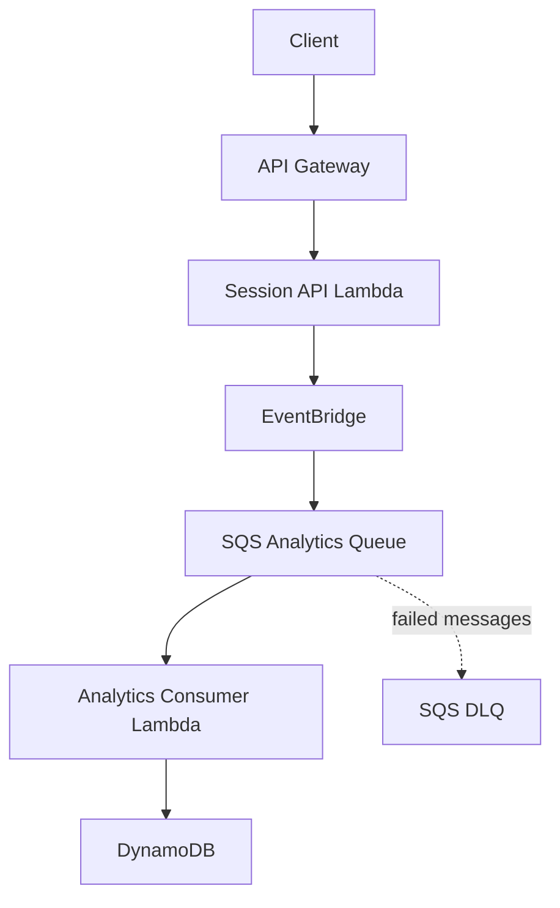

# GameOps Lab

## Stage E — infrastructure skeleton

Stage E adds [`infra/cloudformation/template.yaml`](infra/cloudformation/template.yaml), a conceptual SAM/CloudFormation skeleton for the planned HTTP API, ingest and analytics Lambdas, custom EventBridge bus and rule, SQS work queue and dead-letter queue, and DynamoDB table.

The template intentionally declares no resources; the listed components are comments describing later expansion. Template validation, SAM transformation/build, LocalStack deployment, live AWS deployment, resource creation, and end-to-end runtime integration remain unverified. Stages F–G remain planned.

> GameOps Lab is a local-first, AWS-compatible event-driven gaming analytics platform built in Go to explore serverless architecture, asynchronous processing, reliability, and cloud architecture trade-offs without provisioning billable AWS resources.

## Overview

GameOps Lab is a small portfolio project built around two future Go Lambda
executables: a Session API and an Analytics Consumer. The repository begins with
a deliberately small foundation so the application, AWS adapters,
infrastructure, and runtime evidence can be added in understandable phases.

Stage B source now includes framework-independent session validation, completed
session event construction, and per-session analytics transformation. This
source has not been compiled or tested by Codex; no manual output is recorded
in the repository yet.

Stage D source adds LocalStack-restricted AWS SDK for Go v2 client construction,
an EventBridge publisher, and a DynamoDB analytics store. The adapters are not
wired into the executables and have not contacted LocalStack or AWS.

## Target architecture

The following is the **target architecture**. It is not implemented yet.

## Engineering goals

Later phases are intended to demonstrate:

- event-driven design
- at-least-once delivery
- SQS retry and dead-letter queue handling
- idempotent processing
- DynamoDB conditional or transactional writes
- AWS SAM and CloudFormation
- local-to-AWS portability

These are project goals, not claims about the current implementation.

## Current source capabilities

- **Implemented as source:** session input normalization and validation,
  `SessionEnded` construction, event invariant validation, and one-session
  analytics transformation.
- **Authored as test source:** deterministic unit cases for normalization,
  validation errors, timestamp ordering, whole-second duration behavior,
  invariant protection, analytics mapping, adapter request construction, and
  adapter failure propagation.
- **Implemented as adapter source:** fail-closed LocalStack client
  configuration, one-entry EventBridge publishing, and DynamoDB aggregate
  updates.
- **Verification pending:** AWS SDK dependency resolution, formatting,
  compilation, test discovery, test execution, and observed results.
- **Not implemented:** HTTP or Lambda handling, runtime wiring to EventBridge
  or DynamoDB, SQS consumption, idempotency, LocalStack execution, or deployed
  infrastructure.

## Repository structure

| Path | Purpose |
| --- | --- |
| `cmd/` | Executable entry points for the two future Lambdas |
| `internal/gameops/` | GameOps domain models and framework-independent application logic |
| `internal/aws/` | LocalStack-only EventBridge and DynamoDB adapter source |
| `internal/config/` | Optional environment configuration |
| `infra/cloudformation/` | AWS infrastructure definition |
| `scripts/` | Reserved for later, small workflow helpers |
| `reports/` | Reusable reports and real runtime evidence |
| `docs/` | Human-readable architecture documentation |
| `implementation-note.md` | Running record of foundation decisions and tradeoffs |

## Infrastructure

[`infra/cloudformation/template.yaml`](infra/cloudformation/template.yaml) is
the GameOps infrastructure definition.

- **AWS CloudFormation** is the Infrastructure-as-Code engine.
- **AWS SAM** is a serverless extension of CloudFormation.
- `AWS::Serverless::Function` and `AWS::Serverless::HttpApi` are SAM
  resource types.
- `AWS::SQS::Queue`, `AWS::DynamoDB::Table`, and
  `AWS::Events::EventBus` are native CloudFormation resource types.

SAM resources are still deployed through CloudFormation. The SAM transform
expands the higher-level serverless types into CloudFormation-compatible
resources during deployment. The current template declares that transform but
contains no implemented resources.

During the future Stage F integration work, `sam build` will build the
serverless project and `samlocal deploy` will deploy the SAM/CloudFormation
stack to LocalStack. The real-AWS command `sam deploy` is outside this
local-only workflow and must not be used unless real AWS use is explicitly
chosen later.

## Local-first strategy

LocalStack is the planned AWS-compatible runtime. It will eventually provide
local emulation for API Gateway, Lambda, EventBridge, SQS, DynamoDB, and
CloudFormation. The repository does not require AWS credentials or billable AWS
resources for its intended local workflow.

The Stage D client factory accepts only approved local endpoints and uses dummy
credentials. Current adapters do not provide an intentional AWS fallback, but
the allowlist is an application guard rather than a network-security boundary.
AWS SDK for Go v2 now requires Go 1.24, so the module directive has been raised.
Dependency versions and checksums remain pending until `go mod tidy` is run
manually.

## Development phases

Phase 0 corresponds to engineering Stage A. The numbered phases describe
portfolio milestones; the lettered stages below enforce implementation order.

- **Phase 0 — Repository foundation:** complete
- **Phase 1 — Local AWS infrastructure:** planned
- **Phase 2 — Session API and EventBridge:** planned
- **Phase 3 — SQS consumer and DynamoDB:** planned
- **Phase 4 — Idempotency and failure handling:** planned
- **Phase 5 — Portfolio evidence and architecture review:** planned

Work follows this order:

1. Stage A — Repository foundation: complete
2. Stage B — Go domain/application code: source implemented; verification pending
3. Stage C — Unit tests: source present; execution pending
4. Stage D — AWS adapters: source and mock tests present; dependency/build/runtime verification pending
5. Stage E — SAM / CloudFormation infrastructure: planned
6. Stage F — Local AWS execution and integration verification: planned
7. Stage G — Reports/screenshots: planned

AWS, SAM, `samlocal`, and LocalStack API commands belong only in Stage F.
Earlier stages may be reviewed with local non-AWS development commands.
Stage G documents and evaluates evidence captured during Stage F; it is not a
second infrastructure-execution stage.

## Reports

The [reports directory](reports/README.md) holds reusable report templates and,
later, real screenshots of runtime behavior. Evidence is especially important
for a local-only portfolio project because it makes successful execution,
failure handling, and recovery reviewable without a hosted environment.

No Stage C result or evidence is recorded until the test source is executed and
the observed output is available.

No Stage D result or evidence is recorded until dependencies are resolved and
the adapter tests are executed. LocalStack screenshots remain a Stage F/G
activity.

## Current status

> Stage A is complete. Stage B implementation source, Stage C unit-test source, and Stage D LocalStack-only AWS adapter and test source are present. Dependencies have not been resolved, and Codex has not built or executed the project. Compilation, test results, LocalStack connectivity, and runtime behavior remain unverified. Stages E–G remain planned.
