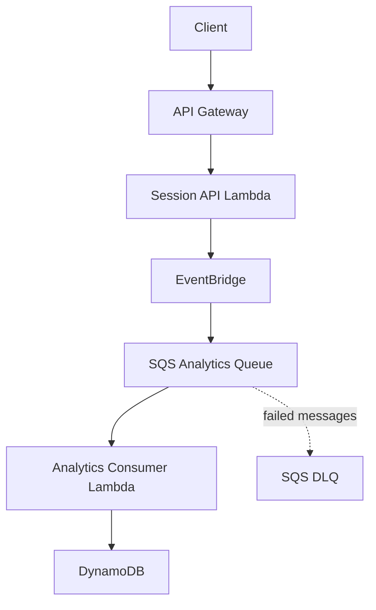

# GameOps Lab

> GameOps Lab is a local-first, AWS-compatible event-driven gaming analytics platform built in Go to explore serverless architecture, asynchronous processing, reliability, and cloud architecture trade-offs without provisioning billable AWS resources.

## Overview

GameOps Lab is a small portfolio project built around two future Go Lambda
executables: a Session API and an Analytics Consumer. The repository begins with
a deliberately small foundation so the application, AWS adapters,
infrastructure, and runtime evidence can be added in understandable phases.

## Target architecture

The following is the **target architecture**. It is not implemented yet.

## Engineering goals

Later phases are intended to demonstrate:

- event-driven design
- at-least-once delivery
- SQS retry and dead-letter queue handling
- idempotent processing
- DynamoDB conditional or transactional writes
- AWS SAM and CloudFormation
- local-to-AWS portability

These are project goals, not claims about the current foundation.

## Repository structure

| Path | Purpose |
| --- | --- |
| `cmd/` | Executable entry points for the two future Lambdas |
| `internal/gameops/` | GameOps domain models and application boundaries |
| `internal/aws/` | Reserved for later EventBridge and DynamoDB adapters |
| `internal/config/` | Optional environment configuration |
| `infra/cloudformation/` | AWS infrastructure definition |
| `scripts/` | Reserved for later, small workflow helpers |
| `reports/` | Reusable reports and real runtime evidence |
| `docs/` | Human-readable architecture documentation |
| `implementation-note.md` | Running record of foundation decisions and tradeoffs |

## Infrastructure

[`infra/cloudformation/template.yaml`](infra/cloudformation/template.yaml) is
the GameOps infrastructure definition.

- **AWS CloudFormation** is the Infrastructure-as-Code engine.
- **AWS SAM** is a serverless extension of CloudFormation.
- `AWS::Serverless::Function` and `AWS::Serverless::HttpApi` are SAM
  resource types.
- `AWS::SQS::Queue`, `AWS::DynamoDB::Table`, and
  `AWS::Events::EventBus` are native CloudFormation resource types.

SAM resources are still deployed through CloudFormation. The SAM transform
expands the higher-level serverless types into CloudFormation-compatible
resources during deployment. The current template declares that transform but
contains no implemented resources.

During the future Stage F integration work, `sam build` will build the
serverless project and `samlocal deploy` will deploy the SAM/CloudFormation
stack to LocalStack. The real-AWS command `sam deploy` is outside this
local-only workflow and must not be used unless real AWS use is explicitly
chosen later.

## Local-first strategy

LocalStack is the planned AWS-compatible runtime. It will eventually provide
local emulation for API Gateway, Lambda, EventBridge, SQS, DynamoDB, and
CloudFormation. The repository does not require AWS credentials or billable AWS
resources for its intended local workflow.

## Development phases

- **Phase 0 — Repository foundation:** complete
- **Phase 1 — Local AWS infrastructure:** planned
- **Phase 2 — Session API and EventBridge:** planned
- **Phase 3 — SQS consumer and DynamoDB:** planned
- **Phase 4 — Idempotency and failure handling:** planned
- **Phase 5 — Portfolio evidence and architecture review:** planned

Work follows this order:

1. Stage A — Repository foundation
2. Stage B — Go domain/application code
3. Stage C — Unit tests
4. Stage D — AWS adapters
5. Stage E — SAM / CloudFormation infrastructure
6. Stage F — Local AWS execution and integration verification
7. Stage G — Reports/screenshots

AWS, SAM, `samlocal`, and LocalStack API commands belong only in Stage F.
Earlier stages may be reviewed with local non-AWS development commands.

## Reports

The [reports directory](reports/README.md) holds reusable report templates and,
later, real screenshots of runtime behavior. Evidence is especially important
for a local-only portfolio project because it makes successful execution,
failure handling, and recovery reviewable without a hosted environment.

## Current status

> Repository foundation only. AWS resources and application flows have not yet been runtime verified.
