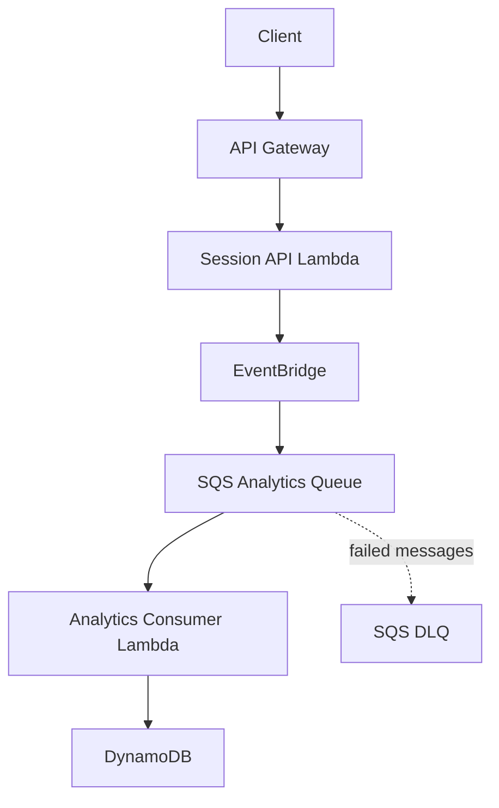

# GameOps Lab Architecture

## TARGET ARCHITECTURE

This diagram describes the intended end state. The AWS resources and application
flow are not implemented in the repository foundation.

| Component | Local implementation | AWS production equivalent |
| --- | --- | --- |
| API | future LocalStack/SAM | API Gateway |
| compute | local Lambda emulation | AWS Lambda |
| event routing | LocalStack EventBridge | Amazon EventBridge |
| queue | LocalStack SQS | Amazon SQS |
| database | LocalStack DynamoDB | Amazon DynamoDB |
| infrastructure | SAM + LocalStack CloudFormation | AWS CloudFormation |

All rows in this table are planned; none have been runtime verified.

## Current application source

The source currently stops before any transport or infrastructure boundary:

- `SessionService.EndSession` normalizes and validates input, then constructs
  a `SessionEnded` event.
- Package-internal event validation protects the invariants shared by session
  and analytics behavior.
- `AnalyticsService.ProcessSessionEnded` converts one validated event into one
  analytics contribution.

These operations perform no I/O. They are not runtime-wired, deployed, or
end-to-end verified, and they do not publish events, consume queues, persist
data, or suppress duplicates. Their compilation and behavior remain unverified
until the unit-test source is manually executed.

Unit-test source now documents the intended contracts for normalization,
validation, duration calculation, and analytics transformation. The tests have
not been executed by Codex, so no pass result or coverage claim is made.

## SAM and CloudFormation

**AWS CloudFormation** is the Infrastructure-as-Code engine. **AWS SAM** is a
serverless extension of CloudFormation. Both SAM and native CloudFormation
resources will live in
[`infra/cloudformation/template.yaml`](../infra/cloudformation/template.yaml),
the single GameOps infrastructure definition.

| Example type | Classification |
| --- | --- |
| `AWS::Serverless::Function` | SAM resource |
| `AWS::Serverless::HttpApi` | SAM resource |
| `AWS::SQS::Queue` | Native CloudFormation resource |
| `AWS::DynamoDB::Table` | Native CloudFormation resource |
| `AWS::Events::EventBus` | Native CloudFormation resource |

SAM resources are deployed through CloudFormation: SAM transforms its
higher-level serverless types into CloudFormation-compatible resources.

In the future integration stage, `sam build` will build the serverless project
and `samlocal deploy` will deploy the SAM/CloudFormation stack to LocalStack.
The real-AWS command `sam deploy` must not be used for this local-only project
unless a later decision explicitly enables real AWS.

## Delivery sequence

1. Repository foundation — complete
2. Go domain and application source — implemented; verification pending
3. Unit tests — source present; execution pending
4. AWS adapters — planned
5. SAM / CloudFormation resources — planned
6. LocalStack execution and integration verification — planned
7. Reports and screenshots — planned

AWS-related commands begin only at step 6. This ordering keeps infrastructure
execution separate from application design and unit-level verification.
